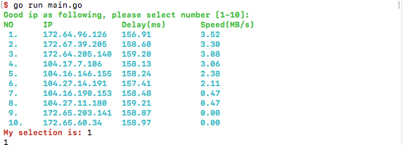

- `func SelectOne(desc, tip string, color_option int, t model.Tasker) int`: select one item from slice

Why need this API?

Usually the options are sample, just like bleow, and we can hanle with `func AddTask(tip string, color int, tasks ...string) string`

```bash
What do you want?
1. Apple
2. Pear
3. Orange
My selection is:
```

But sometimes we need display multiple information for each item, just like below:

```bash
Choose the IP from following:
 1. 	172.64.96.126	156.91		3.52
 2. 	172.67.39.205	158.60		3.30
 3. 	172.64.205.140	159.20		3.08
 4. 	104.17.7.106	158.13		3.06
 5. 	104.16.146.155	158.24		2.38
 6. 	104.27.14.191	157.41		2.11
 7. 	104.16.190.153	158.48		0.47
 8. 	104.27.11.180	159.21		0.47
 9. 	172.65.203.141	158.87		0.00
 10. 	172.65.60.34	158.97		0.00
My selection is:
```

Run this example

